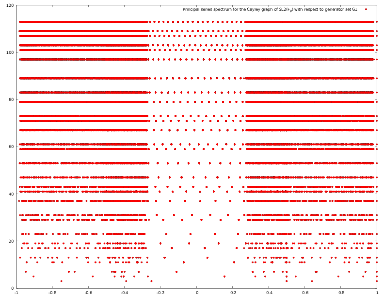

# Representations of SL2(Z/p^nZ)

This is a Python SAGE software library to compute a complete set of exact representations of the finite group SL_2(\mathbb{Z}/p^n\mathbb{Z}), for choice of prime *p>2* and integer *n >= 2*.

Properties of this family (*n* being the free variable) of groups allows dynamic programming techniques to provide efficient algorithms for generating the representations. Fourier transforms can be done over a basis of elements found by Bruhat decomposition.

Eigenvalues of Cayley graphs on these groups can also be computed rapidly, which provides an experimental tool for studying conjectures about the expansion properties of these graphs.

## The paper
This work is in support of a paper [The Computation of Fourier transforms on $SL_2(\mathbb{Z}/p^n\mathbb{Z}) and related numerical experiments](https://arxiv.org/abs/1710.02687).
